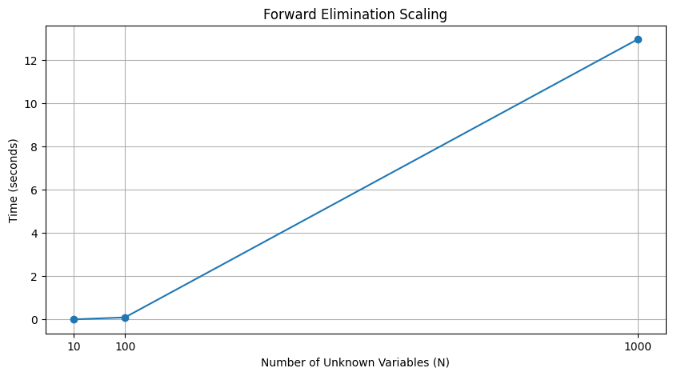
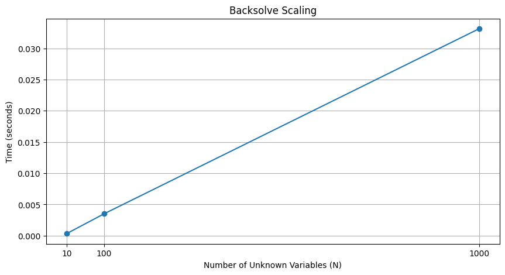

# Gaussian Elimination in Parallel
## Overview
- This program demonstrates that certain tasks do not translate well into parallel.
- We developed a C program that will do gaussian elimination in parallel
- The forward elimination and the backsolving are implemented and measured seperately.
- We run the function on input sizes of random matrices of sizes 10, 100, 1000 to see how the program scales with input. 
 

## Results
- The results show that the program does not scale well when it comes to the forward elimination but it doesn't suffer as such with the backsolving. 
- This is likely because the forward elimination requires thread synchronization and communication whereas the backsolving does not and is much less complex.




## Code
```c
#include <stdio.h>
#include <stdlib.h>
#include <pthread.h>
#include <time.h>
#include <math.h>
// Macro for calculating the min value
#define MIN(a, b) ((a) < (b) ? (a) : (b))

// This will help us pass all the required data to the forward_elimination 
// function which will be run by each thread
typedef struct {
        float **matrix; // 2D array to store the matrix
        int num_rows; // number of rows
        int num_cols; // number of columns
        
        int thread_id; // Current thread id to calculate which rows to process
        // total number of threads we are using. 
        int num_threads; // Used with thread_id to divide the work
        
        // mutex to protext the sync_counter
        pthread_mutex_t *mutex; 
        pthread_cond_t *cond; // condition used to broadcast to other threads
        // that we are ready to go to the next column

        // keeps track of how many threads reached the critical instructions 
        int *sync_counter;  
} thread_data_t; 

// This serves a similar function as thread_data_t but for the backsolving
typedef struct {
    float **matrix; 
    int num_rows;
    int num_cols;
    float *solution; // stores the solution array.
    int variable_index; // the index that the thread will work on
} backsolve_thread_data_t;


// Because we don't want to nest another for loop
void update_row(
        float **matrix,
        int row,
        int start_col,
        int num_cols,
        float factor,
        float *pivot_row
)
{
        int j;
        for (j = start_col; j < num_cols; j++) {
                matrix[row][j] -= factor * pivot_row[j];
        }
}

// Configured to be used by pthreads 
// each thread will perform forward elimination on it's own section. 
void *forward_elimination(void *arg) {
        
        // convert the argument back to struct thread_data_t
        thread_data_t *data = (thread_data_t *)arg;
        
        float factor;
        for (int k = 0; k < data->num_cols - 1; k++) {
                if (k % data->num_threads == data->thread_id) {
                        for (int i = k + 1; i < data->num_rows; i++) {
                                factor = 
                                        data->matrix[i][k] / data->matrix[k][k];

                                update_row(
                                        data->matrix,
                                        i, k,
                                        data->num_cols,
                                        factor,
                                        data->matrix[k]
                                );
                        }
                }

                // lock the mutex before incrementing thread counter
                pthread_mutex_lock(data->mutex);

                (*data->sync_counter)++; // increment the thread counter

                // if not all threads finished on this column
                if (*data->sync_counter < data->num_threads) {
                        // wait for them to be done then proceed to next column
                        pthread_cond_wait(data->cond, data->mutex);
                } else { // else

                        // start over and proceed to next column
                        *data->sync_counter = 0;

                        // let all the other threads know we are done
                        pthread_cond_broadcast(data->cond);
                }

                // unlock the mutex 
                pthread_mutex_unlock(data->mutex);
        }

        pthread_exit(NULL);
}

// Configured to be used by pthreads
// This will be run by each thread in the backsolve function
void *backsolve_thread(void *arg) {
    backsolve_thread_data_t *data = (backsolve_thread_data_t *)arg;
    int i = data->variable_index;
    float sum = 0;
    for (int j = i + 1; j < data->num_cols - 1; j++) {
        sum += data->matrix[i][j] * data->solution[j];
    }
    data->solution[i] = (data->matrix[i][data->num_cols - 1] - sum) / data->matrix[i][i];
    pthread_exit(NULL);
}

// Function to do the backsolving
float *backsolve(float **matrix, int num_rows, int num_cols) {

        // intialize the array to store the solution
        float *solution = malloc(num_rows * sizeof(float));

        // intitialize an array of threads equal to the number of unknowns
        pthread_t *threads = malloc(num_rows * sizeof(pthread_t));

        // Array of the arguments for each thread function call
        backsolve_thread_data_t *thread_data = 
                malloc(num_rows * sizeof(backsolve_thread_data_t));

        // configure the arguments for each thread and create them
        for (int thread_id = num_rows - 1; thread_id >= 0; thread_id--) {
                thread_data[thread_id].matrix = matrix;
                thread_data[thread_id].num_rows = num_rows;
                thread_data[thread_id].num_cols = num_cols;
                thread_data[thread_id].solution = solution;
                thread_data[thread_id].variable_index = thread_id;

                pthread_create(
                        &threads[thread_id],
                        NULL,
                        backsolve_thread,
                        &thread_data[thread_id]
                );
        }

        // Wait for all the threads to complete before ending and returning
        // the solution
        for (int thread_id = num_rows - 1; thread_id >= 0; thread_id--) {
                pthread_join(threads[thread_id], NULL);
        }

        // Free the allocated memory
        free(threads);
        free(thread_data);

        return solution;
}

// Create a num_rows by num_cols matrix with random floats or predefined matrix
float **create_matrix(int num_rows, int num_cols, int predefined)
{
    float **matrix = malloc(num_rows * sizeof(float *));
    if (predefined) {
        // predefined matrix that we know the answer to for testing
        float predefined_matrix[5][6] = {
                {2, -1, 1, 3, 1, 10},
                {1, 3, 2, -1, 2, 5},
                {1, -1, 2, 4, 1, 7},
                {3, 2, -1, 1, 2, 12},
                {2, 1, 3, -2, 1, 3}
        };
        for (int row = 0; row < num_rows; row++) {
            matrix[row] = malloc(num_cols * sizeof(float));
            for (int col = 0; col < num_cols; col++) {
                matrix[row][col] = predefined_matrix[row][col];
            }
        }
    } else {
        for (int row = 0; row < num_rows; row++) {
            matrix[row] = malloc(num_cols * sizeof(float));
            for (int col = 0; col < num_cols; col++) {
                matrix[row][col] = (float)rand() / RAND_MAX * 2000 - 1000;
            }
        }
    }
    return matrix;
}


// Frees all the memory created for a matrix
void free_matrix(float **matrix, int num_rows)
{       
        // free inner rows of the matrix
        int row;
        for (row = 0; row < num_rows; row++) {
                free(matrix[row]);
        }

        // Free the outter memory of the matrix
        free(matrix);
}
// Function to verify the solution
void verify_solution(float **matrix, float *solution, int num_rows, int num_cols)
{
        float sum;
        for (int i = 0; i < num_rows; i++) {
                sum = 0;
                for (int j = 0; j < num_cols - 1; j++) {
                        sum += matrix[i][j] * solution[j];
                }
                if (fabs(sum - matrix[i][num_cols - 1]) > 1e-5) {
                        printf("Solution is incorrect!\n");
                        return;
                }
        }
        printf("Solution is correct!\n");
}

int main()
{
        // initialize our thread sync variables
        pthread_mutex_t mutex = PTHREAD_MUTEX_INITIALIZER;
        pthread_cond_t cond = PTHREAD_COND_INITIALIZER;
        int sync_counter = 0;
        
        // The input matrix sizes to test
        int input_matrix_sizes[] = { 10, 100, 1000 }; 


        for (int size_index = 0; size_index < 3; size_index++) {
                int num_rows = input_matrix_sizes[size_index];
                int num_cols = num_rows + 1;

                float **matrix = create_matrix(num_rows, num_cols, 0);

                // We store the threads and their respective inputs in arrays
                // So that we can iterate through them and execute them. 
                pthread_t *threads = malloc(num_rows * sizeof(pthread_t));
                thread_data_t *thread_data =
                        malloc(num_rows * sizeof(thread_data_t));

                
                clock_t start, end; // setup our timer
                double cpu_time_used;

                start = clock(); // record start time of forward elimination

                for (int thread_id = 0; thread_id < num_rows; thread_id++) {

                        // Initialize all the inputs for this thread
                        thread_data[thread_id].matrix = matrix;
                        thread_data[thread_id].num_rows = num_rows;
                        thread_data[thread_id].num_cols = num_cols;
                        thread_data[thread_id].thread_id = thread_id;
                        thread_data[thread_id].num_threads = num_rows;
                        thread_data[thread_id].mutex = &mutex;
                        thread_data[thread_id].cond = &cond;
                        thread_data[thread_id].sync_counter = &sync_counter;

                        // start the thread and pass the appropriate inputs
                        // forward_elimination() is the function the threads run
                        pthread_create(
                                &threads[thread_id],
                                NULL,
                                forward_elimination,
                                &thread_data[thread_id]
                        );
                }

                // Wait for all threads to complete before proceeding
                for (int thread_id = 0; thread_id < num_rows; thread_id++) {
                        pthread_join(threads[thread_id], NULL);
                }


                end = clock(); // record end time of forward elimination

                // calculate time elapsed and convert to CPU time
                cpu_time_used = ((double)(end - start)) / CLOCKS_PER_SEC;

                // print results for forward elimination
                printf(
                        "Time for forward elimination N=%d: %f seconds\n",
                        num_rows,
                        cpu_time_used
                );

                start = clock(); // record start time of backsolving
                backsolve(matrix, num_rows, num_cols);
                end = clock(); // record end time of backsolving

                // calculate time elapsed and convert to CPU time
                cpu_time_used = ((double)(end - start)) / CLOCKS_PER_SEC;

                // print results for backsolving
                printf(
                        "Time taken for backsolve with N=%d: %f seconds\n",
                        num_rows,
                        cpu_time_used
                );

                // Used to ensure the gaussian elimination is correct
                // Capture the solution array
                // float* solution = backsolve(matrix, num_rows, num_cols);
                // Print the solution
                // printf("Solution:\n");
                // for (int i = 0; i < num_rows; i++) {
                //         printf("%f ", solution[i]);
                // }
                // printf("\n");
                
                // Verify the solution
                // verify_solution(matrix, solution, num_rows, num_cols);

                // Free the solution array
                // free(solution);


                // No memory left behind.
                free_matrix(matrix, num_rows);
                free(threads);
                free(thread_data);
        }

        return 0;
}

```
## Raw outputs

```bash

ziadarafat@dogearchvm ~/D/s/parallel-programming (main)> cd Gaussian_Elimination/
ziadarafat@dogearchvm ~/D/s/p/Gaussian_Elimination (main)> make
gcc -O0 -Wall -Werror -Wextra -pedantic -pthread -lpthread -o gaussian_elimination gaussian_elimination.c
ziadarafat@dogearchvm ~/D/s/p/Gaussian_Elimination (main)> ./gaussian_elimination
Time for forward elimination N=10: 0.001633 seconds
Time taken for backsolve with N=10: 0.000352 seconds
Time for forward elimination N=100: 0.095059 seconds
Time taken for backsolve with N=100: 0.003582 seconds
Time for forward elimination N=1000: 12.931657 seconds
Time taken for backsolve with N=1000: 0.034218 seconds
ziadarafat@dogearchvm ~/D/s/p/Gaussian_Elimination (main)> ./gaussian_elimination
Time for forward elimination N=10: 0.001544 seconds
Time taken for backsolve with N=10: 0.000303 seconds
Time for forward elimination N=100: 0.090941 seconds
Time taken for backsolve with N=100: 0.003233 seconds
Time for forward elimination N=1000: 13.024221 seconds
Time taken for backsolve with N=1000: 0.032342 seconds
ziadarafat@dogearchvm ~/D/s/p/Gaussian_Elimination (main)> ./gaussian_elimination
Time for forward elimination N=10: 0.001593 seconds
Time taken for backsolve with N=10: 0.000289 seconds
Time for forward elimination N=100: 0.087520 seconds
Time taken for backsolve with N=100: 0.003795 seconds
Time for forward elimination N=1000: 12.957925 seconds
Time taken for backsolve with N=1000: 0.032653 seconds
ziadarafat@dogearchvm ~/D/s/p/Gaussian_Elimination (main)> ./gaussian_elimination
Time for forward elimination N=10: 0.001633 seconds
Time taken for backsolve with N=10: 0.000289 seconds
Time for forward elimination N=100: 0.092816 seconds
Time taken for backsolve with N=100: 0.003512 seconds
Time for forward elimination N=1000: 12.753179 seconds
Time taken for backsolve with N=1000: 0.032123 seconds
ziadarafat@dogearchvm ~/D/s/p/Gaussian_Elimination (main)> ./gaussian_elimination
Time for forward elimination N=10: 0.001430 seconds
Time taken for backsolve with N=10: 0.000427 seconds
Time for forward elimination N=100: 0.099994 seconds
Time taken for backsolve with N=100: 0.003431 seconds
Time for forward elimination N=1000: 13.095672 seconds
Time taken for backsolve with N=1000: 0.034295 seconds
```
