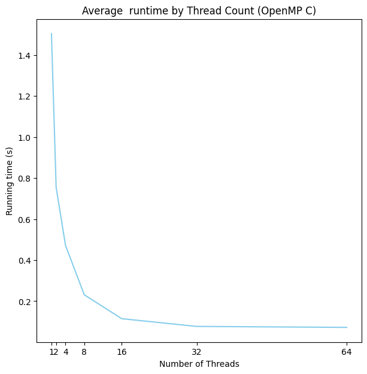
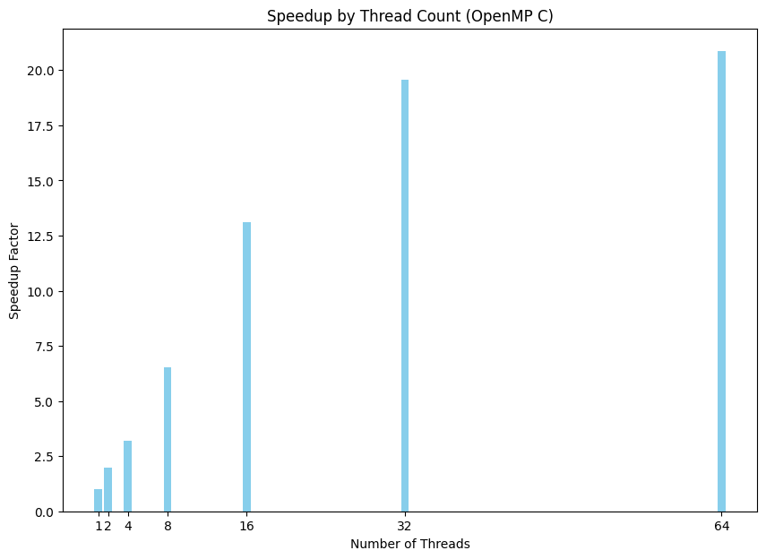
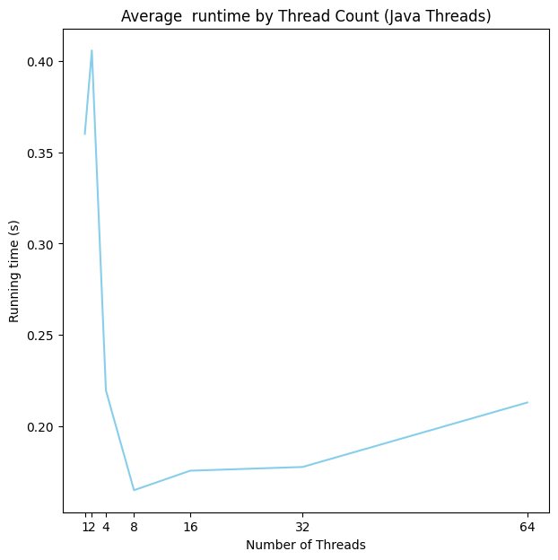
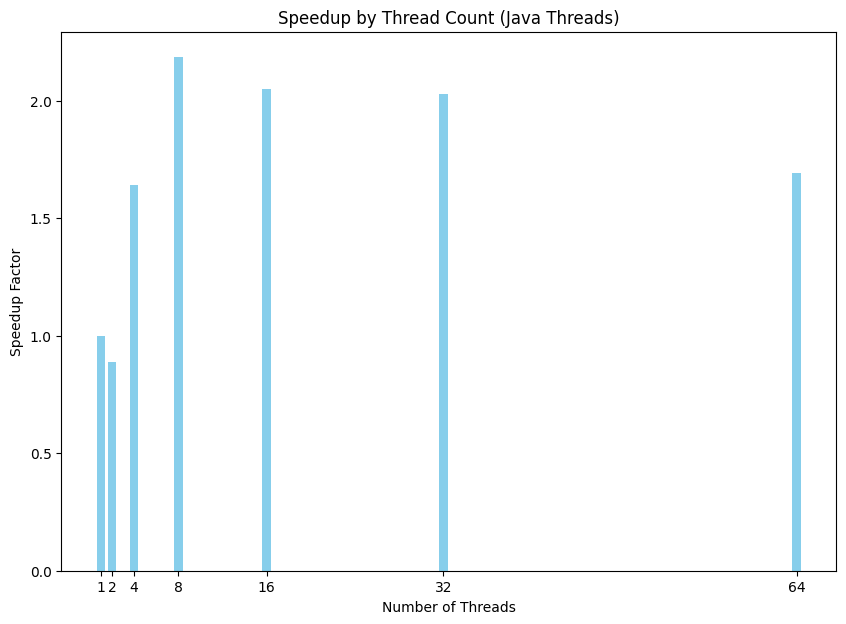
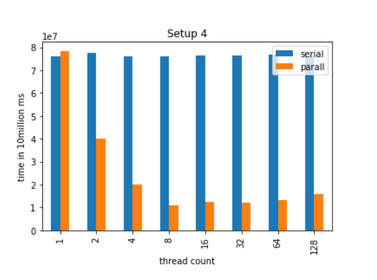

# Lab Report: Performance Comparison of OpenMP, Java Threads, and Pthreads

## Abstract

OpenMP is a parallel programming model that simplifies the development of concurrent applications in C, C++, and Fortran. Unlike traditional threading models, OpenMP uses compiler directives to abstract platform-specific threading mechanisms, allowing for portable and scalable parallelism. This experiment compares the performance of OpenMP in C with Java threads and POSIX threads (pthreads) in C. The objective is to evaluate the scalability of OpenMP on a multi-processor system and its impact on program execution.

## Methods

### Environment

- **System**: Dell PowerEdge R7525 on OpenSUSE Linux Leap ("kaiju" in the CS lab)
- **Specifications**:
  - RAM: 512 GiB
  - CPU Model: AMD EPYC 7313
  - CPUs: 2
  - Speed: 3.9 GHz
  - Cores: 32 (16 per CPU)
  - Threads: 64 (32 per CPU)

### Procedure

- **Execution**: Java and C OpenMP programs were run using a makefile with thread counts of 1, 2, 4, 8, 16, 32, and 64.
- **Timing**: Programs recorded execution times, outputting to a file.
- **Analysis**: Running times parsed by a Python notebook and visualized using matplotlib graphs.
- **Note**: No synchronization was used, focusing on parallel performance benchmarking.
- **Comparison**: C pthreads results were referenced from a previous similar experiment.
- **Code** (see appendix)

## Results

The OpenMP implementation in C demonstrated superior scalability in terms of running time and speedup, particularly evident up to 32 threads. Beyond this point, performance plateaued, likely due to inter-CPU cache sharing inefficiencies. In contrast, Java threads and pthreads showed less stable scaling, with diminishing returns observed at lower thread counts, indicating less efficient use of available processors.

- OpenMP Runtimes


- OpenMP Speedup


- Java Runtimes


- Java Speedup


- C Pthreads Runtimes and comparison to serial


## Conclusion

The experiment underscores OpenMP's efficiency in scaling across multiple processors within a single CPU, as evidenced by the performance plateau at 32 threads corresponding to the single CPU's thread capacity. The diminishing returns observed with Java threads and pthreads suggest that OpenMP's model of parallelism, with its shared memory architecture and compiler optimizations, is more adept at exploiting the computational resources for parallel tasks. This is particularly relevant in systems with a high number of cores and threads, where efficient scaling is crucial. Future work could explore the impact of using differnt algorithms and paradigms such as thread synchronization and semaphores or the use of generalized "reduce/scan" functions.

## Appendix

### Code

#### OpenMP

##### Makefile

```makefile

all: count_threes

count_threes: count_threes.c
	gcc -fopenmp -o count_threes count_threes.c

run:
	for threads in 1 2 4 8 16 32 64; do \
		echo "$$threads threads" >> results.txt; \
		for i in {1..5}; do \
			OMP_NUM_THREADS=$$threads ./count_threes 1000000000 >> results.txt; \
		done; \
	done

	
clean:
	rm -f count_threes results.txt


```

##### Program

```c
#include <stdio.h>
#include <stdlib.h>
#include <time.h>
#include <omp.h>

int count3s(int* array, int length)
{
        int count = 0;
        int i;

        #pragma omp parallel shared(array, count, length) private(i)
        {
                int count_p = 0;

                #pragma omp for
                for (i = 0; i < length; i++) {
                        if (array[i] == 3) {
                                count_p++;
                        }
                }

                // #pragma omp critical
                {
                        count += count_p;
                }
        }

        return count;
}

int main(int argc, char const *argv[])
{
        if (argc != 2) {
                printf("Usage: %s <array_size>\n", argv[0]);
                return 1;
        }

        int length = atoi(argv[1]);
        if (length <= 0) {
                printf("Error: array size must be a positive integer\n");
                return 1;
        }

        int* array = (int*) malloc(length * sizeof(int));
        int i;

        srand(time(NULL));
        for (i = 0; i < length; i++) {
                array[i] = rand() % 10 + 1;
        }

        double start_time, end_time;

        start_time = omp_get_wtime();
        int count = count3s(array, length);
        end_time = omp_get_wtime();

        printf("count: %d\n", count);
        printf("Time taken: %f seconds\n", end_time - start_time);

        free(array);
        return 0;
}
```

#### Java Threads

##### Makefile

```makefile
all: CountThrees.class

CountThrees.class:
	javac CountThrees.java
run:	
	
	for threads in 1 2 4 8 16 32 64; do \
		echo "$$threads threads" >> results.txt; \
		for i in {1..5}; do \
			java CountThrees 1000000000 $$threads >> results.txt; \
		done \
	done


clean:
	rm -f CountThrees.class results.txt
```

##### Program

```java
import java.util.*;

public class CountThrees implements Runnable {
        private static int ARRAY_LENGTH;
        private static int MAX_THREADS;
        private static final int MAX_RANGE = 100;
        private static final Random random = new Random();
        private static int count = 0;
        private static final Object lock = new Object();
        private static int[] array;
        private static Thread[] threads;

        public static void main(String[] args) {
                if (args.length != 2) {
                        System.err.println("Usage: java CountThrees <array_length> <max_threads>");
                        System.exit(1);
                }
                try {
                    ARRAY_LENGTH = Integer.parseInt(args[0]);
                    MAX_THREADS = Integer.parseInt(args[1]);
                } catch (NumberFormatException e) {
                    System.err.println("Invalid argument: " + args[0] + " or " + args[1] + " is not a valid integer");
                    System.exit(1);
                }
                array = new int[ARRAY_LENGTH];

                // Initialize the elements in the array
                for (int i = 0; i < array.length; i++) {
                        array[i] = random.nextInt(MAX_RANGE);
                }
                long startTime = System.nanoTime();

                // Create the threads
                CountThrees[] counters = new CountThrees[MAX_THREADS];
                int lengthPerThread = ARRAY_LENGTH / MAX_THREADS;
                for (int i = 0; i < counters.length; i++) {
                        counters[i] = new CountThrees(
                                i * lengthPerThread, 
                                lengthPerThread
                        );
                }

                // Run the threads
                threads = new Thread[MAX_THREADS];
                for (int i = 0; i < counters.length; i++) {
                        threads[i] = new Thread(counters[i]);
                        threads[i].start();
                }

                for (int i = 0; i < counters.length; i++) {
                        try {
                                threads[i].join();
                        } catch (InterruptedException e) {
                                // Do nothing
                        }
                }
                long endTime = System.nanoTime();
                // Print the number of threes
                System.out.println("Number of threes: " + count);

                // compute the elapsed time in nanoseconds
                long duration = (endTime - startTime);  

                // convert to seconds
                double seconds = (double)duration / 1_000_000_000.0; 

                System.out.println("Time taken: " + seconds + " seconds");
        }

        private int startIndex;
        private int elements;
        private int myCount = 0;

        public CountThrees(int start, int elem) {
                startIndex = start;
                elements = elem;
        }

        // Overload of run method in the Thread class
        public void run() {
                // Count the number of threes
                for (int i = 0; i < elements; i++) {
                        if (array[startIndex + i] == 3) {
                                myCount++;
                        }
                }

                // synchronized (lock) {
                //         count += myCount;
                // }

                count += myCount;
        }
}
```
